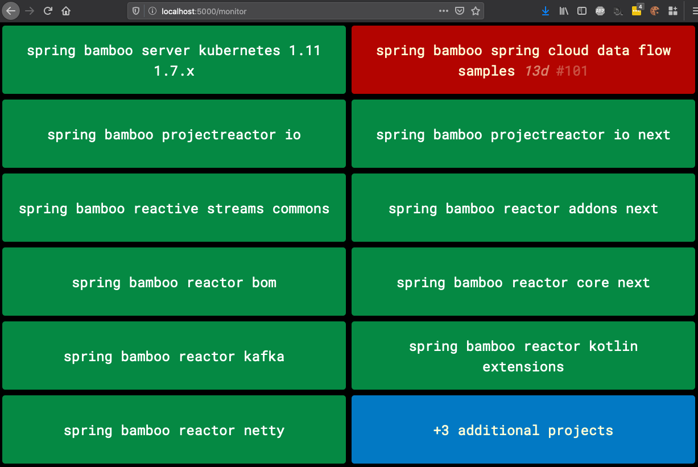
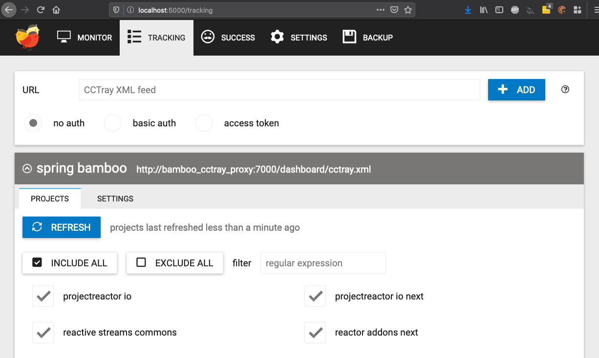

# Bamboo-to-CCTray Proxy

[](https://github.com/chadlwilson/bamboo_cctray_proxy/actions) 

Bamboo-to-CCTray is a small Ruby proxy application that can expose Atlassian Bamboo continuous integration build statuses 
in the [CCTray XML format](https://cctray.org/), originally inspired by CruiseControl, and still supported by 
most CI servers (cloud and non-cloud-based). But not Bamboo!

This allows the many tools written to support monitoring of builds to be used with Atlassian Bamboo builds. 
Examples of such tools are build radiator/monitor tools such as [NeverGreen](https://github.com/build-canaries/nevergreen)
and user notification tools such as CCMenu

This was [originally developed in 2010](http://bitbucket.org/amanking/to_cctray/) by [@amanking](https://github.com/amanking), 
and later ported to GitHub, moved to modern Ruby, Bamboo REST API (rather than RSS feeds), Dockerized and augmented
to support monitoring entire Bamboo projects.

## Examples

Bamboo builds on [NeverGreen](https://github.com/build-canaries/nevergreen) (with healthy builds showing; for clarity)

Auto-detection of Bamboo builds:


You can see this example yourself in [./examples](./examples/docker-compose.yml) and run with
```bash
git clone git@github.com:chadlwilson/bamboo_cctray_proxy.git && cd bamboo_cctray_proxy.git/examples
docker-compose up
```

## Usage

1. Setup your configuration in `config/bamboo.xml`
1. Run it by one of the mechanisms below
1. Navigate to http://localhost:7000/dashboard/cctray.xml to view the feed; point your tools at this

### Docker

```bash
mkdir -p config && touch config/bamboo.xml # Put your config here
docker run -p 7000:7000 -v $(pwd)/config:/app/config chadwilson/bamboo_cctray_proxy:latest
```

### Running from source

```bash
git clone git@github.com:chadlwilson/bamboo_cctray_proxy.git && cd bamboo_cctray_proxy
bundle install --without=test
cd ramaze && ruby -rrubygems start.rb
```

## Configuration

The Bamboo servers and builds to monitor are specified in `config/bamboo.yml`. 

Example configuration:
```yaml
# Monitor specific builds by their build plan keys
- spring_cloud_data_builds:
    url: https://build.spring.io
    build_keys:
      - SCD-K8S19B15X
      - SCD-SCDFSAMPLES

# Monitor entire projects with their project keys
- spring_reactor_project:
    url: https://build.spring.io
    projects:
      - REACTOR

# You can use either of the patterns above with a secured Bamboo server
# Note; the password is in plain-text.
- secured_bamboo:
    url: https://secret.bamboo.org
    basic_auth:
      username: username
      password: password
    build_keys:
      - ABC

# Returns ALL plans the user has permissions to view on the server.
# Be careful; this probably won't perform well; especially not on a public server!
- secured_bamboo_all_plans:
    url: https://secret.bamboo.org
    basic_auth:
      username: username
      password: password
```

# Resources

* Atlassian Bamboo: http://www.atlassian.com/software/bamboo/
* CCTray XML format: https://cctray.org/
* NeverGreen: https://github.com/build-canaries/nevergreen
* CCMenu (Mac OS X): http://ccmenu.sourceforge.net/
* BuildNotify (Linux): http://bitbucket.org/Anay/buildnotify/
